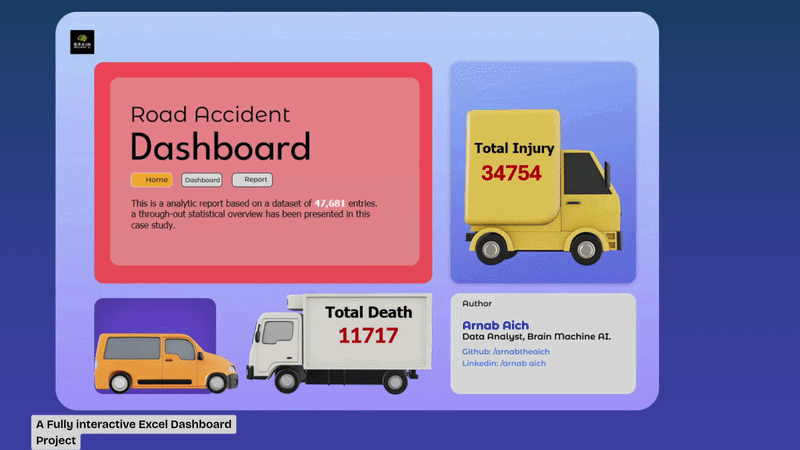

<div align="center">

# 🚦 Bangladesh Road Accident Analysis Dashboard
### *Microsoft Excel | Data Cleaning | Dashboard Design | Business Intelligence*

Transforming **raw, noisy road accident records** into actionable insights through an interactive Excel dashboard.

<p>


</p>

</div>

---

# 📸 Dashboard Preview

<p align="center">
  
</p>

# 🎬 Dashboard Demo

<p align="center">
  
</p>

---

# 📑 Table of Contents

- Project Overview
- Business Problem
- Objectives
- Tech Stack
- Data Cleaning & Feature Engineering
- Dashboard Features
- Key Insights
- Repository Structure
- Documentation
- Skills Demonstrated
- Future Improvements
- Author

---

# 📌 Project Overview

This project showcases an end-to-end analytics workflow using Microsoft Excel. Starting from a noisy road accident dataset, I cleaned, standardized, validated, and transformed the data into an interactive dashboard that helps stakeholders monitor accident trends, identify high-risk areas, and explore accident patterns.

# 🎯 Business Problem

Traffic accident data is difficult to analyze in its raw form due to inconsistent values, redundant fields, missing information, and unstructured records.

The dashboard answers:
- Which locations experience the highest accident frequency?
- How have accidents changed over time?
- Which victim groups are most vulnerable?
- Which environmental conditions contribute to severe accidents?
- Which vehicle types are most frequently involved?

# 🛠 Tech Stack

| Category | Tools |
|-----------|-------|
| Dashboard | Microsoft Excel |
| Data Cleaning | Excel, Power Query |
| Visualization | Pivot Charts, Pivot Tables |
| Interactivity | Slicers, Timelines |
| Reporting | KPI Cards, Dynamic Charts |

# 🧹 Data Cleaning & Feature Engineering

- Removed duplicate records
- Eliminated redundant columns
- Standardized inconsistent values
- Cleaned noisy location names
- Handled missing values
- Resolved inconsistent temporal fields
- Built analytical features
- Optimized the dataset for dashboard reporting

# 📊 Dashboard Features

- Interactive KPI Cards
- Accident Trend Analysis
- Fatality & Injury Analysis
- Area-wise Distribution
- Vehicle & Victim Analysis
- Interactive Slicers
- Dynamic Reporting

# 📈 Key Insights

- Accident hotspots identified.
- Yearly trends visualized.
- Vulnerable groups highlighted.
- Interactive decision support.

# 📁 Repository Structure

```text
Bangladesh-road-accident-analysis-project-Excel
├── dashboard/
├── data/
├── documentation/
├── assets/
├── Dashboard Preview 2.jpg
├── demo.gif
└── README.md
```

# 📚 Documentation

- Business Requirements
- Data Cleaning Methodology
- Case Study
- Dashboard Demo

# 💼 Skills Demonstrated

- Data Cleaning
- Feature Engineering
- Dashboard Design
- Data Visualization
- Business Intelligence
- Exploratory Data Analysis
- Microsoft Excel

# 🚀 Future Improvements

- Power BI version
- GIS Mapping
- Predictive Analytics
- Automated refresh

# 👨‍💻 Author

**Arnab Aich**

GitHub: https://github.com/Arnabtheaich

LinkedIn: https://www.linkedin.com/in/arnab-aich/

---

<div align="center">

### ⭐ If you found this project helpful, please consider giving it a Star!

</div>
